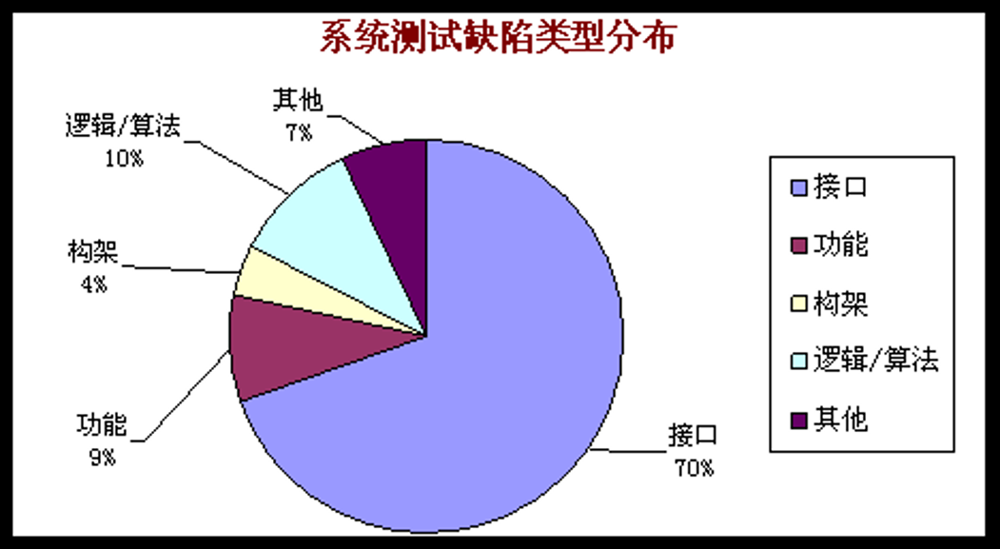
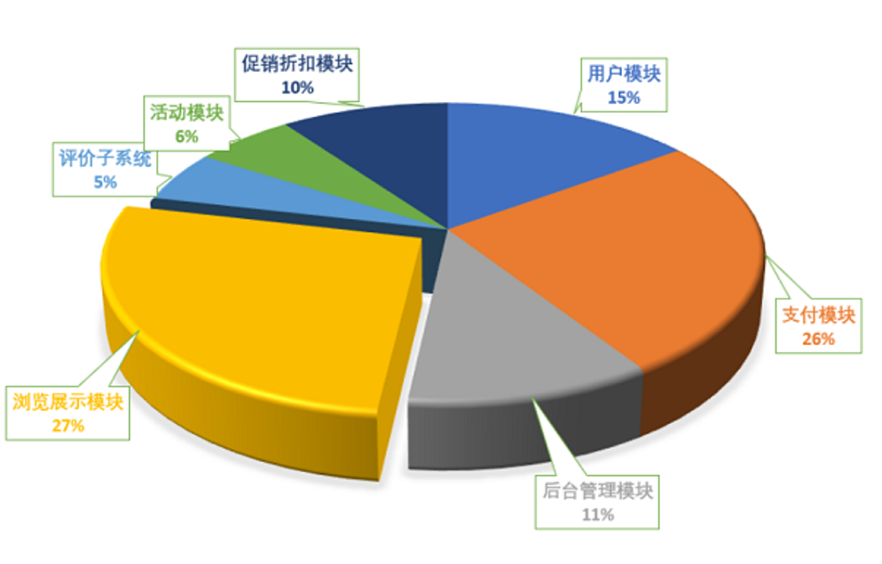
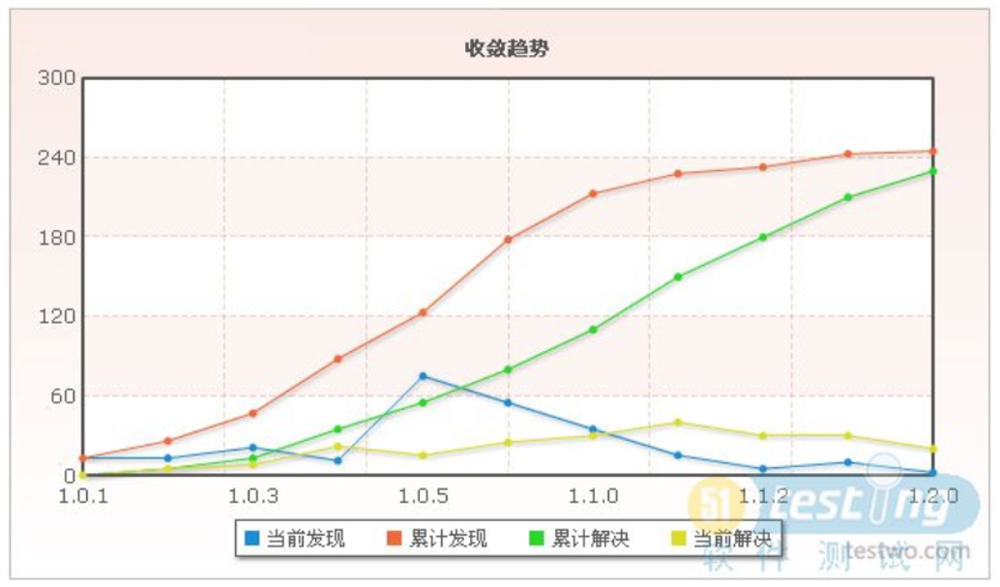
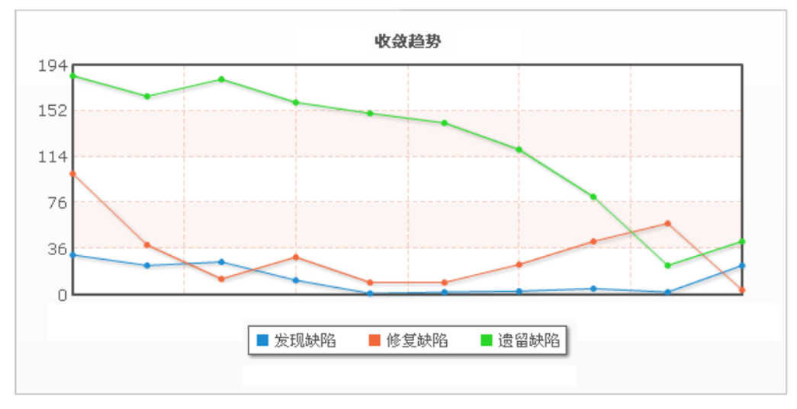
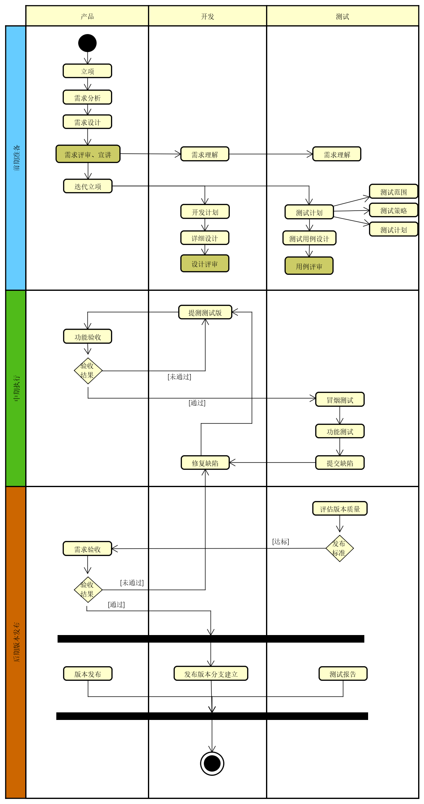
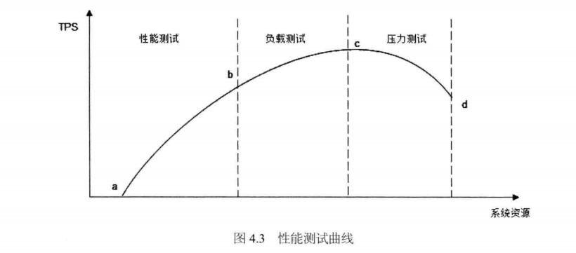
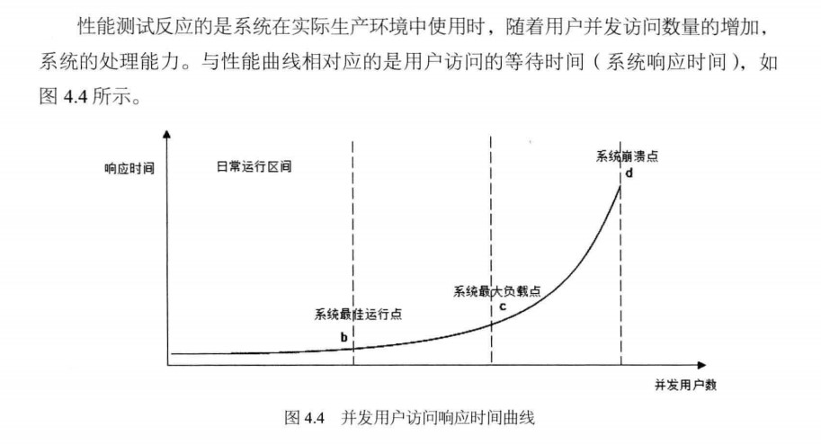
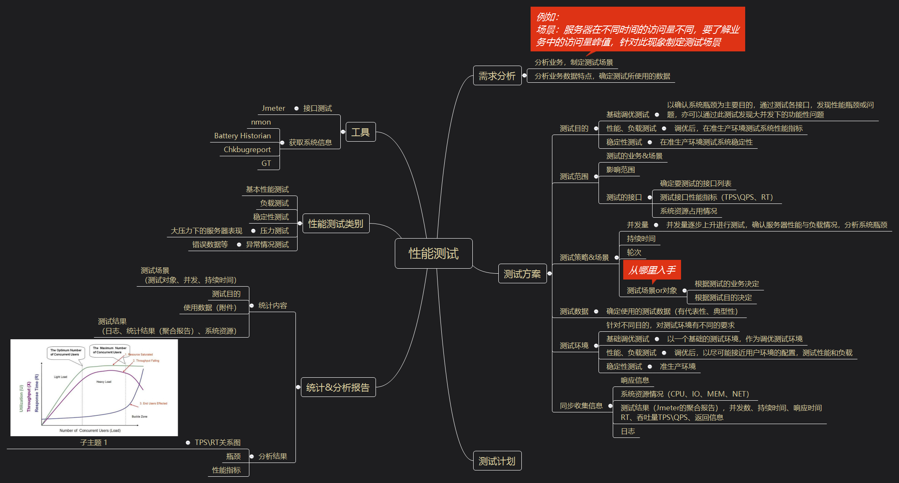

## Author: Jean

## 测试规范

### 缺陷规范

1. 缺陷报告
   * 标题：简要描述缺陷的现象
   * 描述：缺陷的详细描述
   * 重现步骤：分点描述重现缺陷的步骤，确保开发和其他人员能够参考步骤重现缺陷
   * 测试版本：软件版本
   * 环境：OS/浏览器
   * 期待结果：根据需求规格说明，描述正确的操作状态
2. 缺陷的其他属性
   * 严重程度
   * 优先级
   * 状态（缺陷的生命周期）
   * 修复影响范围（开发者）

### 缺陷的严重程度级别
>  严重程度是缺陷对软件功能影响程度强弱的定义。

状态 | 状态说明 | 例如
--------|----------|---------
Fatal | 致命的软件缺陷。事件非常重要, 测试工作无法继续进行,需要马上给予关注解决。 | A.由于程序所引起的死机,非法退出, 运行中断,应用程序崩溃。  B.死循环。  C.导致数据库发生死锁。 D.数据通讯错误。  E.严重的数值计算错误。
Critical | 严重错误的软件缺陷。事件是重要的,并且应该在紧急的事件处理之后尽快得到解决，但应在发布前解决。 | A.主要功能部分丧失。  B.缺少功能,与需求不符。  C.数据流错误。  D.程序接口错误。  E.轻微的数值计算错误。  
Major | 一般错误的软件缺陷。事件是重要的,但是由于解决问题需要花费一定的时间,所以可以用较长的时间解决,如果时间紧可以留下个版本解决。 | A. 次要功能没有完全实现但不影响使用  B.界面文字等错误。  C.打印内容、格式错误。  D.简单的输入限制未放在前台进行控制。  E.删除操作未给出提示。  
Minor | 较小错误的软件缺陷。不影响功能的正常使用,可以在时间和资源允许的情况下再解决。 | A.辅助性说明描述不清楚。  B.显示格式不规范。  C.长时间操作未给用户进度提示。  D.提示窗口文字未采用行业术语。  E.可输入区域和只读区域没有明显的区分标志。  F.系统处理未优化。  
Enhancemental | 建议问题的软件缺陷。测试建议（非缺陷），可以在发布后再商量是否改进。 | A. 测试建议。

### 缺陷的优先级
> 软件被修复的紧急程度。

状态 | 状态说明 | 例如
--------|----------|---------
Immediate | 马上解决 | 问题必须马上解决，否则系统根本无法达到预定的需求。 
High | 高度重视 | 有时间就要马上解决，否则系统偏离需求较大或预定功能不能正常实现。
Normal | 正常处理 | 问题不影响需求的实现，但是影响其他使用方面，比如页面调用出错，调用了错误的等。
Low | 低优先级 | 问题在系统发布以前必须确认解决或确认可以不予解决。

### 缺陷的状态

状态 | 状态说明 | 操作人员
---------|----------|---------
New | 首次录入。 | 测试人员
Open | 已经确认是缺陷，并等待修改。 | 开发经理/项目经理
Fixed | 修改完成后待回归测试验证。 | 开发经理/开发人员
Resolved | 回归测试验证通过。 | 测试人员
Reopen | 回归测试验证不通过,再次等待修改。 | 测试人员
Closed | 回归测试验证通过，且无需再跟踪。 | 测试人员
Rejected | 讨论后认为不是缺陷或拒绝修改。 | 开发经理/开发人员
Delayed | 延迟修改。 | 开发经理/开发人员/缺陷评审委员会

### 缺陷分析
缺陷分析的过程，是对迭代过程复盘、缺陷根因分析的过程。通过缺陷分析，能够对迭代提供提升质量的方法和依据。

1. 从缺陷本身产生的原因分析。
   * 需求引入缺陷（需求有歧义、需求没有定义清楚等）
   * 设计引入缺陷（设计阶段结构未考虑全面、接口数据库设计不合理等）
   * 代码缺陷（未Review代码，开发人员未理解需求）
   * reopen缺陷
2. 从缺陷分布特点分析，能够对软件版本的质量有所评估。

3. 从缺陷收敛度看版本质量。
   特别在发版前，通过缺陷的收敛程度，能够评估出当前版本质量以及发布风险。

## 测试思维

### 产品化思维 
> 测试前，不仅要了解产品需求，也要了解需求产生的背景及原因，从而知晓需求的来龙去脉。这样有助于更好的理解需求，也能针对业务场景的各种情况，设计出更合理和完善的测试方案。

业务出发，分析需求，注重用户场景
1. 分析业务，对当前需求和产品有初步了解：
   * 了解业务针对人群
   * 了解业务根本出发点（核心、目的）

### 结构化思维
结构化思维，使用在测试过程中面对的各种类型的测试内容。比如需要从一个需求点衍生出测试点、测试用例等；有比如需要统计分析众多的缺陷，从而找到问题发生的根源，以便提升产品质量。推荐下面的文章，从2个角度来理解结构化。

- 推荐文章：https://mp.weixin.qq.com/s?__biz=MjM5ODY4ODIxOA==&mid=2653204683&idx=1&sn=7a355868c6e3acf97a3172fe5ed82684&chksm=bd16f47e8a617d687e940244fb6a9c55ec14a408382bcbb7f6a4df5271de0d68ed3bff3f2b6b&scene=21#wechat_redirect

#### 如何使用结构化 
1. 问题型问题：先结构化，再抽丝剥茧，从结构自上而下，通过归类、拆解，形成一个有条理的树形结构然后逐个解决。
2. 信息型问题：与问题型问题相反，信息型问题是一个自下向上的过程，这种思考过程是：信息罗列、信息归纳，得到规律，是一个不断收拢的过程。

## 测试过程
> 测试的目的是要确保软件质量，测试也是不断推进团队提升质量的过程。

### 流程图

### 测试过程分类
> 针对不同的测试对象，会进行不同类别的测试工作。测试类别其实与测试阶段和测试目的息息相关，不同的阶段和目的对应的测试类别和测试方法也不尽相同。

#### 功能测试
功能测试阶段，要测试软件的每一个功能是否已满足需求规格说明书规定的内容。
1. 测试设计方法
功能测试，往往从需求分析理解入手，再进行用例设计。不同的功能运用不同的设计方式，能够有效的提高测试用例覆盖率，达到不遗漏需求点的目的。
   * 等价类划分
   * 边界值
   * 异常类
   * 因果图
   * 正交表
2. 缺陷
* 缺陷提交
   测试人员将测试过程中发现的软件缺陷以书面方式提交给开发人员。有关缺陷报告如何书写，请参考上半部的测试规范相关内容。
* 缺陷分析
  根据缺陷分析结果，有助于评估版本质量，根据当前质量确定测试策略的合理性。

#### 性能测试
性能测试通常是指测试软件在一定条件下处理事件的能力/效率。
1. 测试指标
   首先也是最重要的，要根据业务需求、用户场景等因素，确定出系统的性能指标。
2. 性能测试分类
   不同的测试目的，会做不同类型的测试，以下几种性能测试的区别可以通过下图看出。
   * 性能测试
   * 负载测试
   * 压力测试
   * 稳定性测试

3. 性能测试方案

#### 兼容性测试
兼容性测试主要用来测试软件在特定的硬件平台上、不同的应用软件之间、不同的操作系统平台上、不同的网络等环境中是否能够很友好的运行的测试。

**机型的选择&测试内容**

1. 适配机型的选择
   首先要定义软件的目标市场，确定当前软件支持的**机型**和**系统版本**、**系统分辨率**。比如，优先支持ios10以上的版本以及所有苹果机型；Android系统支持7以上的版本，且支持市场占有率top100的机型。
2. 浏览器的选择
   针对一些WEB程序，其需要依赖浏览器使用，不同浏览器表现也不尽相同。这也意味着在兼容性测试上，需要考量浏览器维度。
3. 兼容性测试内容的评估
   一般的兼容性测试主要关注模块UI层面的兼容，还有主要功能上的兼容性。

#### 自动化测试
自动化测试需要依赖各种测试框架，结合代码编写，搭建适合产品的自动化测试平台。
 ##### Airtest平台（支持测试Unity游戏）
 > 从当前市面上的平台查找，只找到了网易的Airtest 平台支持测试Unity 游戏。其使用的是Poco  UI自动化框架框架，能够识别unity的元素（按钮等）。
 * http://airtest.netease.com/docs/cn/index.html
 * https://poco.readthedocs.io/zh_CN/latest/

**使用总结**
* 搭建一整套环境后（ios），发现airtest的稳定性不好，较频繁的出现重连设备的问题，在自动化测试中，反应时间也过慢。导致其测试效率和成本并没有因为自动化平台的使用而改善。因此暂时不再使用此平台进行测试调试。

## 测试框架

### 测试方案
**要素**  
* 目的
* 需求范围
* 测试对象
  * 分析测试对象，有助于测试策略的制定。比如从功能角度看，有新增需求、影响的已有功能等。从性能角度看，何种业务场景下，达到何种性能指标。
* 测试策略
  * 测试策略是指，在测试前期分析测试对象，针对其特点，确定合理的测试方法、测试轮次等信息。一旦测试策略确定
* 测试方法
  根据不同的测试对象和测试阶段，可选用不同的测试方法。细分测试对象，使用不同的测试方法，可以提升测试覆盖率。
  * 冒烟测试
  * 功能测试
  * 回归测试
  * 探索性测试
  * 性能测试
  * 兼容性测试

### 工时预估&测试进度

### 测试用例设计
测试设计是在测试框架里不可不提的内容。它是推进功能测试很重要的工具，并且系统化了待测试需求，用测试语言罗列了待测试的内容，即每一条Testcase。在这里仅做了非常简单的介绍。具体的测试用例设计方法，还需要通过网络或实践来了解并熟悉。
#### 测试用例设计方法
（包括但不限于）
1. 等价类划分
2. 边界值
3. 异常类
4. 因果图
5. 正交表
#### 测试设计辅助工具
1. PICT 组合测试用例工具
2. All Pair 配对测试工具

### 其他概念
迭代、版本、发布、测试左移、质量控制等等

## 测试总结报告
### 测试概要
1. 测试范围
2. 测试内容（测试阶段、轮次以及测试方法）

### 缺陷
#### 缺陷统计分析
1. 缺陷分布（模块分布、版本分布、类型分布）
2. 缺陷reopen情况
3. 缺陷修复情况（收敛趋势）

#### 遗留缺陷
1. 遗留的原因和背景
2. 遗留缺陷的解决方案

### 问题&建议
#### 需求建议
1. 需求分析、需求评审、需求描述等过程的优化或改进

#### 版本管理

#### 流程建议

### 隐患/风险

## 测试工具
1. postman
   接口测试工具
      向服务器发送GET\POST等 命令，测试http接口
2. Loadrunner
   性能测试
      特点：支持各种协议，主要是性能测试（负载、压力），支持多并发，并且有图形化的统计分析功能
3. Jmeter
   性能测试
   接口测试
4. fiddler
   抓包工具
   特点：手机与电脑同一局域网，手机设置网络代理为电脑IP，电脑运行fiddler后，可以获取到手机http协议的访问包
   限制：app不支持通过代理上网的话，就无法
5. Badboy
   脚本录制工具，可以录制web协议请求
6. adb
   Android 系统的工具，部分功能需要手机的ROOT权限
   adb命令可以连接手机，并对手机进行一系列命令操作
   adb bugreport，获取手机的电池电量等信息文件
7. Battery Historian
   分析Android 手机bugreport的工具，图形化
   能看到battery、camera、wifi、温度、电量等使用情况
8. Chkbugreport
   分析Android的bugreport.txt文件
9. GT
   监控ios Android的CPU、MEM等使用率

## 学习网站

